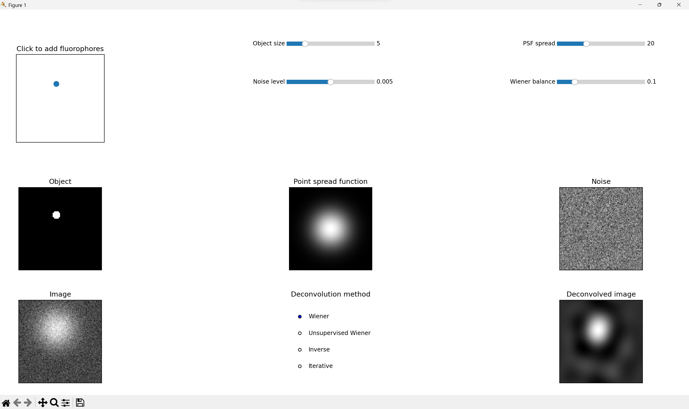
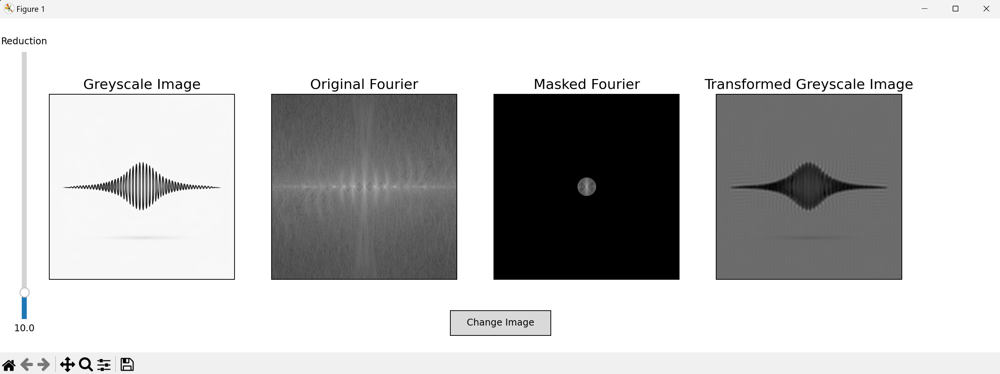
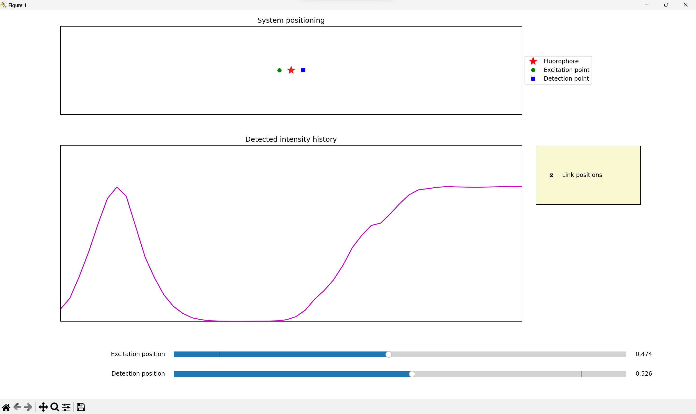
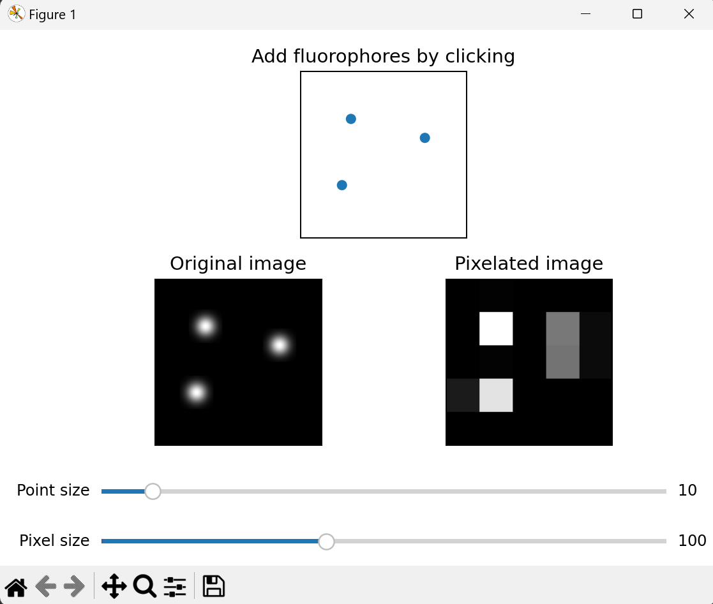

# Microscopy visualization tools

This repository contains a collection of Python scripts designed to demonstrate various principles of microscopy. 

## Scripts Included

1. **Convolution and deconvolution of an object**

Demonstrates convolution process that occurs in the microscope (the object is convolved with a PSF) and the effect of noise on the resulting image. 
Different deconvolution methods can be used to reconstruct the original image, however, all implementations act only on the 2D image. 

    File: De_convolution_microscope_animation.py

2. **Fourier transformation of an image**

Visualizes Fourier transformation of an image and the effect of cutting off higher frequencies.
Fourier transformation is what occurs in the back-focal plane of the objective, and removing more of the higher frequencies corresponds to having an objective with lower numerical aperture. 

    File: Fourier_frequency_reduction_animation.py
    
3. **Misalignment of fluorescent excitation and detection**

Enables measuring of the detected fluorescence when excitation and detection point are misaligned.
When excitation and detection are not aligned, the maximum detected intensity will be when the fluorophore is placed halfway between the excitation and detection spot (considering the equal sigma of the respective PSFs).
This principle is applied in different reassignment microscopy methods, such as Zeiss AiryScan or Optical Photon Reassigment Microscopy (OPRA - Roth et al., 2013).

    File: Misaligned_excitation_detection_animation.py

4. **Demonstration of pixel sampling on the retainment of the details**

The script demonstrates the need for having small enough pixels when representing details in a microscope image. This need is formulated by a Nyquist criterion.

    File: Pixel_sampling_animation.py

## Installation

To run these scripts, you will need Python installed on your system, along with several packages.

### Prerequisites

- Python 3.6 or higher
- pip (Python package installer)
- Git (Version control system)

### Clone the repository

First, clone the repository using Git:

git clone https://github.com/isvecova/microscopy-visualization-tools.git
cd microscopy-visualization-tools

### Set up a virtual environment (Recommended)

python -m venv venv
source venv/bin/activate  # On Unix or MacOS
venv\Scripts\activate  # On Windows

### Install required packages

pip install -r requirements.txt

### Ensure tkinker library is available

tkinter is part of the standard Python library. If your installation of Python doesn't include tkinter, you may need to install it separately. 

## Usage

After installation, you can run the scripts directly from the command line:

python script-name.py

Replace script-name with the name of the script you wish to run.

## Contributing

Contributions to this project are welcome! If you have any suggestions or questions, please contact me on svecovaiva01@gmail.com

## License

This project is licensed under the MIT License - see the LICENSE.md file for details.

## Acknowledgments

These scripts have been created with a significant contribution from GPT4 (https://chatgpt.com/) and with support from my colleagues from the Microscopy Service Centre, IEM, Prague - Štěpán Kortus and Barbora Hyklová. 
